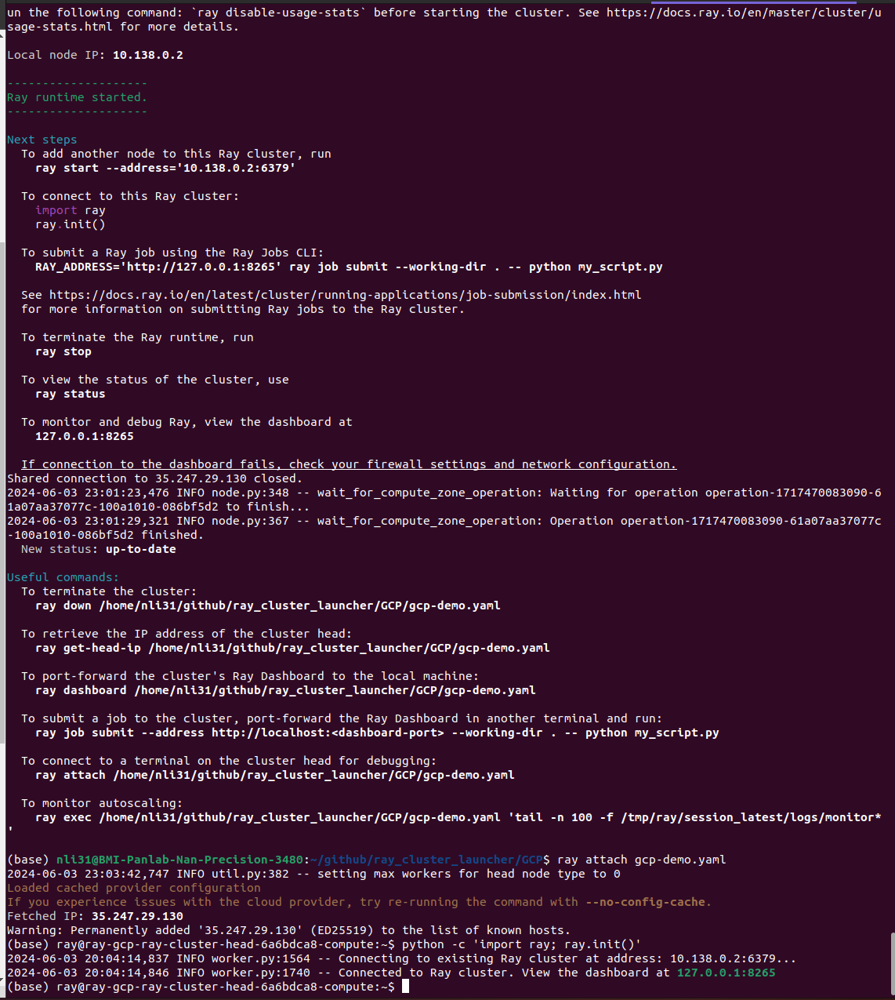
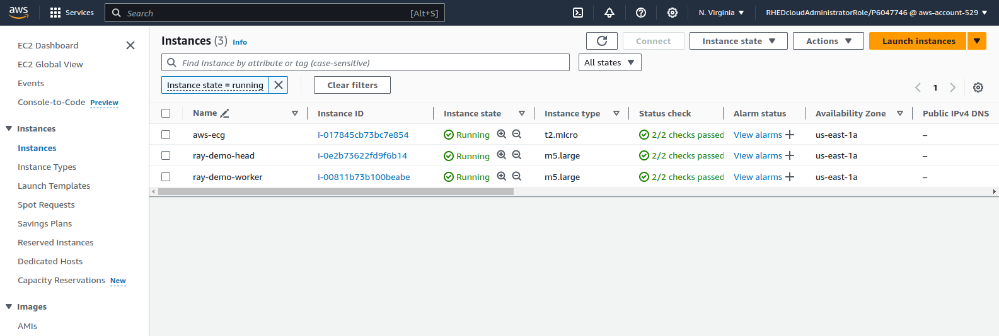
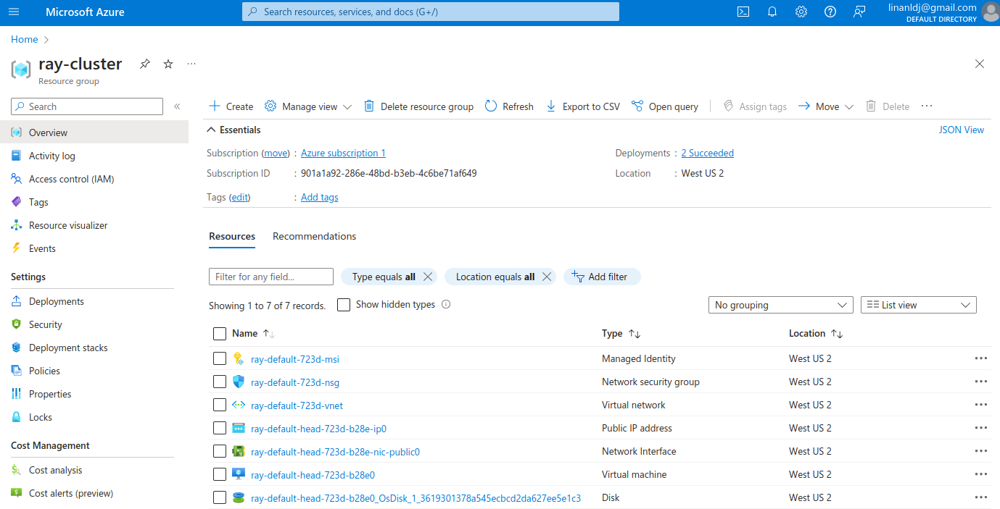
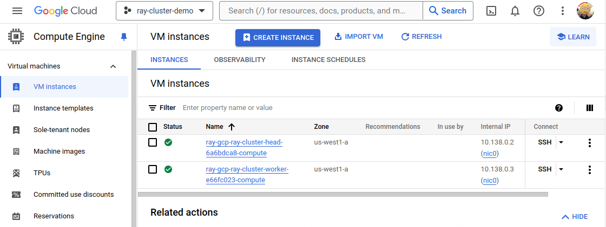

# Instruction of Launching Ray cluster on AWS, Azure, and GCP


## Preparation - install Ray CLI
Please use pip to intall the ray CLI on local environment
```
# install ray
pip install -U ray[default]
```
<br>


## Configure Ray Cluster laucher .yml files for AWS, Azure, and GCP

All launcher template .yaml files are modified and based on Ray offical cluster config files:

[aws-example-full.yaml](https://github.com/ray-project/ray/blob/master/python/ray/autoscaler/aws/example-full.yaml), [azure-example-full.yaml](https://github.com/ray-project/ray/blob/master/python/ray/autoscaler/azure/example-full.yaml), and [gcp-example-full.yaml](https://github.com/ray-project/ray/blob/master/python/ray/autoscaler/gcp/example-full.yaml)

<br>

### A. Configure Ray Cluster on AWS at Emory


1. Install and Configure [Emory TKI CLI](https://it.emory.edu/tki/)

2. Go to AWS Console and login

3. Go to `EC2` > `Security Group` and create a security group for ray cluster and set `GroupName` at [line 50](./aws-ray-cluster-launcher-template.yaml#L50) 

4. Go to `EC2` > `Key Pairs` and create key pair for ray cluster and set `keyName` at [line 59](./aws-ray-cluster-launcher-template.yaml#L59), [line 84](./aws-ray-cluster-launcher-template.yaml#L84) and [line 118](./aws-ray-cluster-launcher-template.yaml#L118).

5. Go to `VPC` > `Subnets` and create subnet for cluster and set `SubnetIds` for ray header and worker nodes at [line 77](./aws-ray-cluster-launcher-template.yaml#L77) and [line 111](./aws-ray-cluster-launcher-template.yaml#L111) 
set subnet   

6. login AWS CLI

### B. Configure Ray Cluster on Azure

1. Install and Configure [the Azure CLI](https://cloud.google.com/sdk/docs/install)

    ```
    # Install azure cli and bundle.
    pip install azure-cli azure-identity azure-mgmt azure-mgmt-network

    # Login to azure. This will redirect you to your web browser.
    az login
    ```
<br>

2. Use `ssh-keygen -f </path/to/key-folder> -t rsa -b 4096` to generate a new ssh key pair for ray cluster laucher VM. Azure ray cluster laucher will use the key to control header and worker nodes later.
    ```
    # generate the ssh key pair.
    ssh-keygen -f </path/to/key-folder> -t rsa -b 4096

    ```
<br>

3. Modify and Configure Ray cluster launcher file for Azure
   - On [line 64, and 66](./azure-ray-cluster-launcher-template.yaml#L64), point to the ssh key that you generate on your local path.
   - On [line 119](./azure-ray-cluster-launcher-template.yaml#L119), mount the ssh public key to VMs. 
<br>


### C. Configure Ray Cluster on GCP

1. Login and create GCP project and get \<gcp-project-id> on GCP Console. User need to modify `project_id` by using user's project If on [line 42](./gcp-ray-cluster-launcher-template.yaml#L42).

<br>

2. Go to **APIs and Services** panel to Enable the following APIs on GCP Console:
   - Cloud Resource Manager API
   - Compute Engine API
   - Cloud OS Login API
   - Identity and Access Management (IAM) API   

<br>

3. Generate a ssh key for your gcp project:
    ```
    ssh-keygen -t rsa -f </path/to/ssh-key-folder> -C <user-name> -b 2048
    ```

<br>

4. Go to **Metadata** panel and click **SSH KEYS** tab to upload the public ssh key on GCP project. All instances in the project inherit these SSH keys. 

<br>

5. Modify `ssh_private_key` to point the ssh private key on [line 59](./gcp-ray-cluster-launcher-template.yaml#L59). Set `KeyName` in the head and worker node on [line 77](./gcp-ray-cluster-launcher-template.yaml#L77) and [line 113](./gcp-ray-cluster-launcher-template.yaml#L113).

<br>

6. Install and Configure [the gcloud CLI](https://cloud.google.com/sdk/docs/install)
    ```
    # install pre-requisites  
    apt-get install apt-transport-https ca-certificates gnupg curl

    # install gcp cli
    apt-get install google-cloud-cli

    # inital and config gcp
    gcloud init

    ```

<br>

GCP References:
[How to add SSH keys to VMs](https://cloud.google.com/compute/docs/connect/add-ssh-keys#:~:text=existing%20SSH%20keys-,To%20add%20a%20public%20SSH%20key%20to,metadata%2C%20use%20the%20google_compute_project_metadata%20resource.&text=AAAAC3NzaC1lZDI1NTE5AAAAILg6UtHDNyMNAh0GjaytsJdrUxjtLy3APXqZfNZhvCeT%20test%20EOF%20%7D%20%7D-,If%20there%20are%20existing%20SSH%20keys%20in%20project%20metadata%2C%20you,the%20the%20Compute%20Engine%20API.) (step 5)


## Start and Test Ray with the Ray cluster launcher
It works by running the following commands from your local machine:
```
# Create or update the cluster
ray up <your-ray-cluster-template-for-different-platform>.yaml

# Get a remote screen on the head node.
ray attach <your-ray-cluster-template-for-different-platform>.yaml

# Try running a Ray program.
python -c 'import ray; ray.init()'
exit

# Tear down the cluster.
ray down <your-ray-cluster-template-for-different-platform>.yaml
```



**After Ray cluster up successfully, users should be able to check the running ray clusters on different platform console.**

**For AWS at Emory:**


<br>


**For Azure portal:**


<br>

**For GCP Console:**

